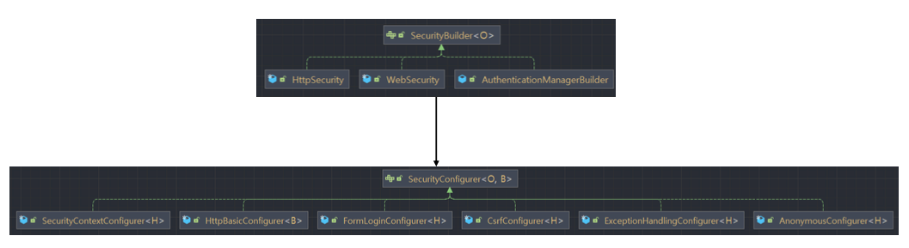
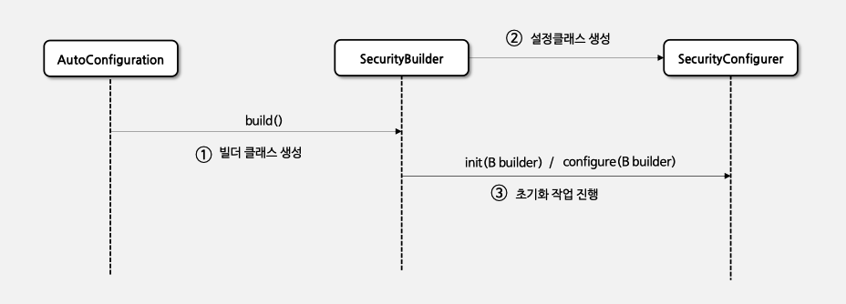
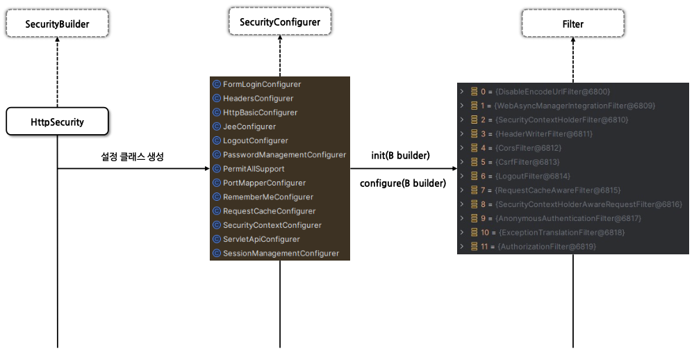

## Spring Security 2일차

### SecurityBuilder / SecurityConfigurer
> 1. 초기화 작업이 이루어지는 과정

---
### 1. 초기화 작업이 이루어지는 과정
> 스프링 시큐리티는 **초기화 때 인증/인가와 관련된 여러가지 작업**들을 한다. 이 때 작업을 하는 2개의 클래스가 있다.
> 1. `SecurityBuilder` : *웹 보안을 구성하는 빈 객체와 설정클래스들을 생성*하는 역할(`WebSecurity`, `HttpSecurity`)
> 2. `SecurityConfigurer` : *HTTP 요청과 관련된 보안처리를 담당하는 필터들을 생성*하고 여러 초기화 설정에 관여

- `SecurityBuilder` 는 `SecurityConfigurer` 클래스를 참조하고 있으며 인증/인가 초기화 작업은 `SecurityConfigurer`에 의해 진행된다.

    

#### 초기화 작업이 이루어지는 과정
1. `AutoConfiguration`에 의해서 `SecurityBuilder` 클래스를 생성
2. `SecurityBuilder` 클래스가 `SecurityConfigure` 타입의 설정 클래스들을 생성한다.
3. `SecurityConfigure` 는 내부적으로 `init()` 메서드와 `configure()` 메서드를 가지고 있다. 이 메서드들은 인자로 `SecurityBuilder` 타입을 받는다.
4. `SecurityConfigure` 는 `init()` 메서드와 `configure()` 메서드로 초기화작업(인증/인가 등등)을 진행한다.

    
- 아래 그림은 `HttpSecurity` 라는 `Bean` 객체가 여러 설정클래스(`SecurityConfigurer`)를 생성하고, 그 설정 클래스들이 초기화 작업(`init()`, `configure()`)을 하면서 여러 `필터(Filter)`들을 생성하는 과정이다.

    
