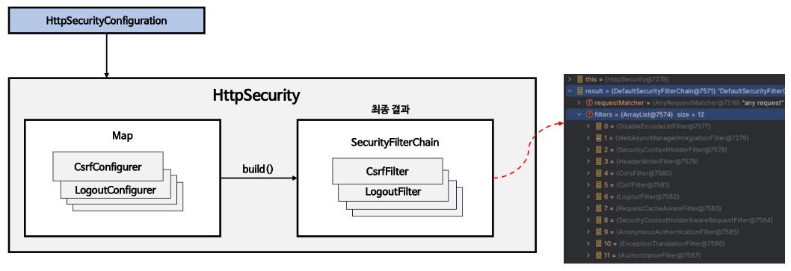
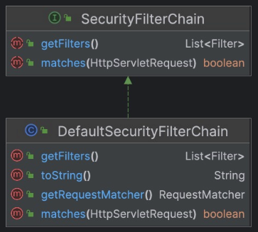
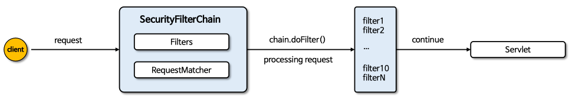
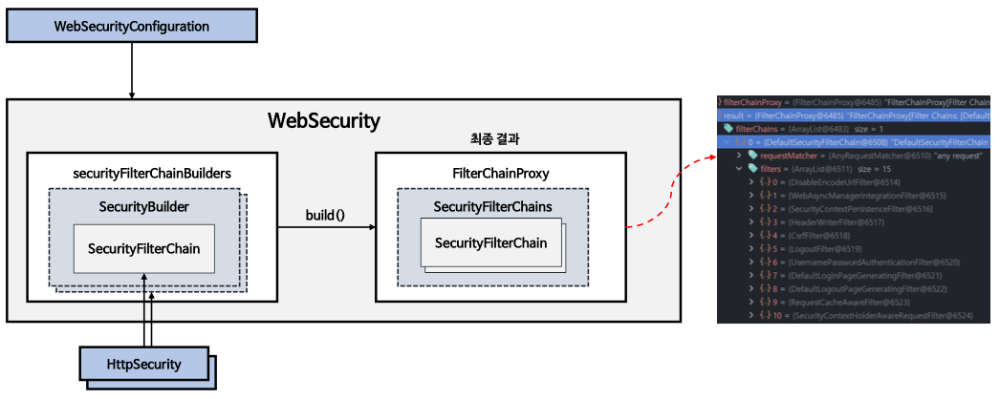

## Spring Security 3일차

### WebSecurity / HttpSecurity
> 1. HttpSecurity
> 2. SecurityFilterChain
> 3. WebSecurity
---
### 1. HttpSecurity
- `HttpSecurityConfiguration` 에서 `HttpSecurity` 를 생성하고 초기화를 진행한다.
- `HttpSecurity` 는 보***안에 필요한 각 설정 클래스와 필터들을 생성***하고 최종적으로 **`SecurityFilterChain` 빈을 생성**한다.

    
---
### 2. `SecurityFilterChain`
- `SecurityFilterChain` 은 `getFilters()` 와 `matches()` 를 가지고 있는 인터페이스이고, 구현체는 `DefaultSecurityFilterChain` 클래스이다.
    
    
- `boolean matches(HttpServletRequest request) 메서드`
  - 현재요청(`request`)이 `SecurityFilterChain` 에 의해 처리되어야 하는지 여부를 결정한다.
  - `true` 면 현재요청이 `SecurityFilterChain` 에 의해 처리된다. `false` 면 다른 필터체인이나 다른 메서드에 의해 처리된다.
  - 즉, ***특정 요청에 대한 적절한 보안 필터링 로직이 적용***될 수 있도록 한다.
- `List<Filter> getFilters() 메서드`
  - 현재 `SecurityFilterChain`에 포함된 `Filter` 객체의 **리스트를 반환**한다.
  - 이 메서드를 통해 어떤 필터들이 현재 필터 체인에 포함되어있는지 확인할 수 있고, 각 필터는 요청 처리 과정에서 특정작업을 수행한다.
    
- `Client(브라우저)`가 `서버(Spring)`으로 `요청(request)`를 하면 `SecurityFilterChain` 에 `RequestMatcher가` 요청을 **매칭하여 필터체인이 갖고 있는지 체크**한다.
- 필터에서 모든 요청을 처리하고 서블릿으로 전달한다.

    
---
### 3. WebSecurity
- `HttpSecurityConfiguration` 에서 `WebSecurity` 를 생성하고 초기화를 진행한다.
- `WebSecurity` 는 `HttpSecurity` 에서 생성한 `SecurityFilterChain` 빈을 `SecurityBuilder` 에 저장한다.
- `WebSecurity` 가 `build()`를 실행하면 `SecurityBuilder` 에서 `SecurityFilterChain`을 꺼내어 `FilterChainProxy` 생성자에게 전달한다.
- 즉, **`SecurityFilterChain` 의 필터들을 `FilterChainProxy` 가 관리하고 사용**한다.

  

---
> [참고자료](https://www.inflearn.com/course/%EC%8A%A4%ED%94%84%EB%A7%81-%EC%8B%9C%ED%81%90%EB%A6%AC%ED%8B%B0-%EC%99%84%EC%A0%84%EC%A0%95%EB%B3%B5/dashboard)
