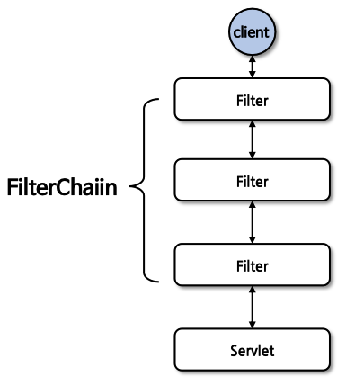
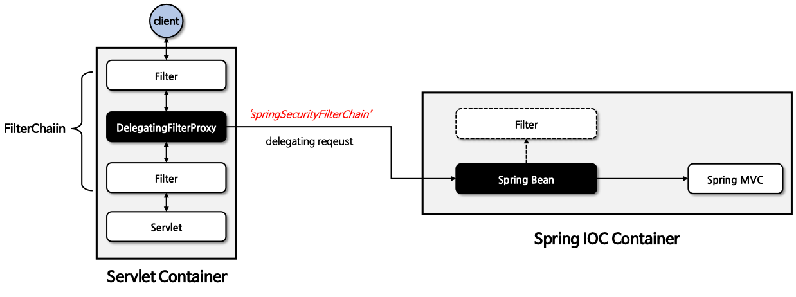
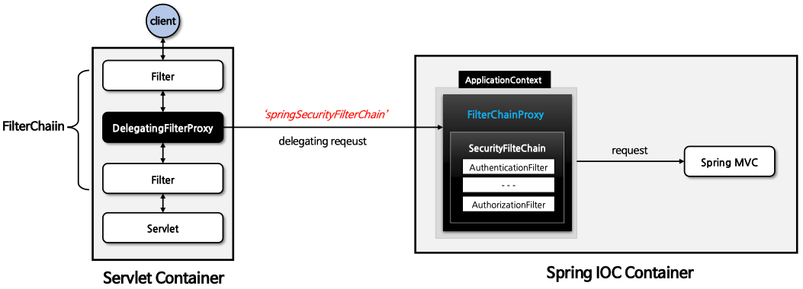
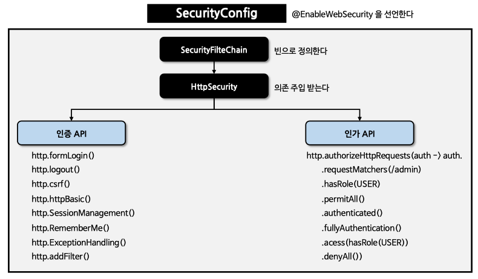

## Spring Security 4일차

### DelegatingFilterProxy / FilterChainProxy
> 1. Filter
> 2. DelegatingFilterProxy
> 3. FilterChainProxy
> 4. 사용자 정의 보안 설정하기
---
### 1. Filter
- `서블릿 필터(Servlet Filter)`는 웹 어플리케이션에서 **클라이언트의 요청과 서버의 응답을 가공하거나 검사**하는데 사용한다.
- 서블릿 필터는 **클라이언트의 요청이 서블릿에 도달하기 전이나 서블릿의 응답을 클라이언트에게 보내기 전에 특정 작업을 수행**할 수 있다.
- 서블릿 필터는 WAS(서블릿 컨테이너 또는 Tomcat)에서 `생성(init)`되고 `실행(doFilter)`되고 `종료(destroy)`된다.

    
- 예시코드는 아래와 같다.
    ```java
    public class ExampleFilter implements Filter {
        @Override
        public void init(FilterConfig filterConfig) throws ServletException {
            // 필터 초기화 시 필요작업 수행
        }
    
        @Override
        public void doFilter(ServletRequest req, ServletResponse resp, FilterChain chain) throws IOException, ServletException {
            // 요청 처리 전에 수행할 작업(pre-processing)
            chain.doFilter(req, resp); // 다음 필터로 요청/응답 객체 전달
            // 응답 처리 후에 수행할 작업(post-processing)
        }
        
        @Override
        public void destroy(){
            // 필터가 제거될 때 필요한 정리 작업을 수행
        }
    }
    ```
---
### 2. DelegatingFilterProxy
> `DelegatingFilterProxy` 는 실제 보안처리를 하는 필터가 아닌 스프링 컨테이너(IoC)와 연결고리를 하는 필터이다.

- `DelegatingFilterProxy` 는 스프링에서 사용되는 특별한 서블릿 필터이다.
- `DelegatingFilterProxy` 는 서블릿 필터의 기능을 수행하는 동시에 ***스프링 의존성 주입(DI) 및 Bean 관리 기능과 연동되도록 설계된 필터***이다.
- `DelegatingFilterProxy` 는 `springSecurityFilterChain` 이름으로 생성된 `Bean` 을 `ApplicationContext` 에서 찾아 ***요청을 위임***한다.
- _**실제 보안 처리를 수행하지 않는다.**_

    
- 위 그림처럼 `springSecurityFilterChain` 의 이름으로 생성되는 Filter Bean 은 `FilterChainProxy` 이다.
---
### 3. FilterChainProxy
- `FilterChainProxy` 는 **DelegatingFilterProxy 로 부터 요청을 위임 받고 보안 처리 역할**을 한다.
- 내부적으로 하나 이상의 SecurityFilterChain 객체들을 갖고 있으며 **요청 URL 정보를 기준으로 적절한 SecurityFilterChain을 선택하여 필터들을 호출**한다.
- 사용자의 요청을 필터 순서대로 호출함으로 보안 기능을 동작시키고 필요 시 직접 필터를 생성해서 기존의 필터 전/후로 추가 가능하다.

  
---
### 4. 사용자 정의 보안 설정하기
> 한 개 이상의 `SecurityFilterChain` 타입의 Bean 정의 후 인증(Authentication) API 및 인가(Authorization) API 를 설정한다.

- 먼저 `SecurityConfig` 라는 클래스를 생성한 후 반드시 `@EnableWebSecurity` 를 클래스위에 선언해줘야 한다.
- 다음 `SecurityFilterChain` 빈으로 정의 후 `HttpSecurity` 를 의존 주입을 받는다.
- `HttpSecurity` 빈 객체를 통해 `인증API` 및 `인가API`를 설정할 수 있다.

  

#### 기본 구현 코드
- `@EnableWebSecurity` 를 클래스에 정의한다.
- `SecurityFilterChain` 을 Bean 등록을 하게 되면 자동설정에 의한 `SecurityFilterChain` 빈은 생성되지 않는다.
  ```java
  @EnableWebSecurity
  @Configuration
  public class SecurityConfig {
  
    @Bean
    public SecurityFilterChain securityFilterChain(HttpSecurity http) throws Exception {
      http.authorizeHttpRequests(auth -> auth.anyRequest().authenticated())
              .formLogin(Customizer.withDefaults());
      
      return http.build();
    }
  }
  ```

#### 사용자 추가 설정
- 스프링 시큐리티는 사용자에게 인증을 위한 기본계정을 하나 준다.
- 하지만 사용자가 따로 설정할 수 있다. 방법은 다음 2가지다.
  1. `application.yml` 파일에 추가
     ```yaml
     spring:
       security:
         user:
           name: user
           password: 1111
           roles: USER
     ```
  2. Java 설정 클래스에 직접 정의한다.
     ```java
     @Bean
     public inMemoryUserDetailsManager inMemoryUserDetailsManager() {
  
       UserDetails user = User.withUsername("user")
               .password("{noop}1111")
               .authorities("ROLE_USER")
               .build();
       return new InMemoryUserDetailsManager(user);
     }
     ```
- 우선순위는 Java 설정 클래스가 `application.yml` 보다 우선순위를 가진다.
