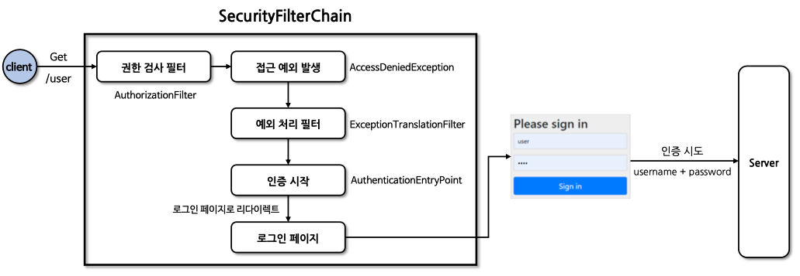
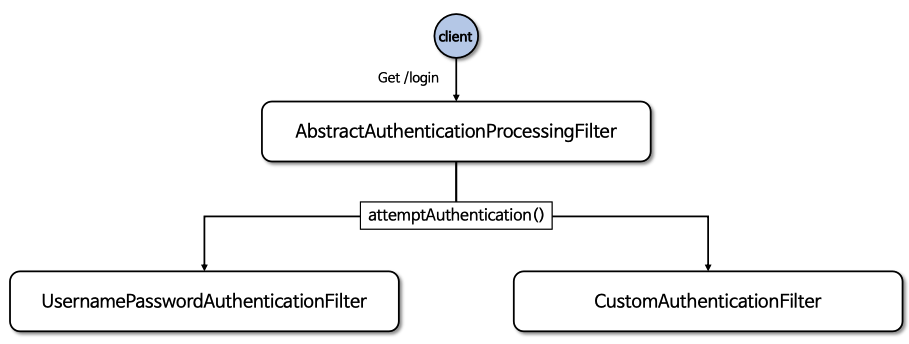

## Spring Security 5일차

### 폼 인증 - formLogin() / UsernamePasswordAuthenticationFilter
1. 폼 인증 - formLogin()
2. 폼 인증 필터 - UsernamePasswordAuthenticationFilter

---
### 1. 폼 인증 - formLogin()

#### 폼 인증
- **HTTP 기반의 폼 로그인 인증 메커니즘을 활성화하는 API** 로서 사용자 인증을 위한 사용자 정의 로그인 페이지를 쉽게 구현할 수 있다.
- 기본적으로 SpringSecurity 가 제공하는 기본 로그인 페이지를 사용하며 사용자 이름과 비밀번호 필드가 포함된 간단한 로그인 양식을 제공
- 사용자는 HTML Form을 통해 자격증명(username, password)을 제공하고 Srpgin Security 는 HttpServletRequest 에서 이 값을 읽어온다.

#### 폼 인증 흐름
- `client` 가 `server`로 요청을 보내면 `SecurityFilterChain` 에서 수많은 필터들을 거치고 제일 마지막 필터인 `AuthorizationFilter` 가 있다.
- `AuthorizationFilter` 는 요청에 대해 ***client가 요청 URL에 접근할 수 있는지 없는지 결정***을 한다.
- 만약 인증 받지 못한 client 라면 `AccessDeniedException` 라는 접근 예외를 발생시킨다.
- `ExceptionTranslationFilter` 가 접근예외를 처리하는 필터이다.
- `ExceptionTranslationFilter` 는 수많은 역할을 하지만 그 중 ***인증을 받지못한 사용자에게 다시 인증을 받을 수 있도록 로그인 페이지로 이동***시켜준다.
- `AuthenticadtionEntryPoint` 를 통해 ***인증을 다시 받게 하고 로그인 페이지로 리다이렉트***를 한다.
- `Client` 가 `username`, `pw` 를 입력하고 ***인증을 다시 받고 인증이 성공하면 자격증명을 가지고 Server 에 접근***한다.

  

#### formLogin() API
- `FormLoginConfigurer` 설정 클래스를 통해 여러 API들을 설정할 수 있다.
- 내부적으로 `UsernamePasswordAuthenticationFilter` 가 생성되어 **폼 방식의 인증 처리를 담당**하게 된다.
  ```java
  import org.springframework.security.web.authentication.AuthenticationFailureHandler;
  import org.springframework.security.web.authentication.AuthenticationSuccessHandler;
  
  @EnableWebSecurity
  @Configuration
  public class SecurityConfig {
  
    @Bean
    public SecurityFilterChain securityFilterChain(HttpSecurity http) throws Exception {
      http.formLogin(httpSecurityFormLoginConfigurer -> httpSecurityFormLoginConfigurer
              .loginPage("/loginPage") // 사용자 정의 로그인 페이지로 이동(기본 로그인페이지 무시)
              .loginProcessingUrl("/loginProc") // 사용자 이름과 비밀번호를 검증할 URL (HTML Form 전송 시 action 값)
              .defaultSuccessUrl("/", true) // 로그인 성공 이후 이동 페이지, 두번째 인자가 true 면 무조건 지정된 위치로 이동(기본은 false)
                                            // false 은 로그인 페이지로 직접 접근한 경우에만 지정된 URL 이동. 이전에 접근하려던 URL 이 있으면 리다이렉션
              .failureUrl("/failed") // 인증에 실패할 경우 사용자에게 보내질 URL 을 지정(기본값은 /login?error 이다)
              .usernameParameter("username") // 인증 수행 시 사용자 이름(HTML Form 태그의 name 값)
              .passwordParameter("password") // 인증 수행 시 사용자 비밀번호(HTML Form 태그의 name 값)
              .failureHandler(AuthenticationFailureHandler) // 인증 실패 시 사용할 AuthenticationFailureHandler 지정하여 로그인 성공 후 사용자 정의로직 실행
                                                            // 기본값은 SimpleUrlAuthenticadtionFalureHandler 를 사용하여 /login?error 로 리다이렉션
                                                            // defaultSuccessUrl() 보다 우선순위를 가진다.
              .successHandler(AuthenticationSuccessHandler) // 인증 성공 시 사용할 AuthenticationSuccessHandler 를 지정
                                                            // 기본값은 SavedRequestAwareAuthenticationSuccessHandler 이다.
                                                            // failureUrl() 보다 우선순위를 가진다.
              .permitAll() // failureUrl() , loginPage() , loginProcessingUrl() 에 대한 모든 사용자의 접근을 허용함
      );
      
      return http.build();
    }
  }
  ```
---
### 2. 폼 인증 필터 - UsernamePasswordAuthenticationFilter
> 스프링 시큐리티는 `AbstractAuthenticationProcessingFilter` 클래스를 ***사용자의 자격 증명을 인증하는 기본 필터***로 사용한다.

- `UsernamePasswordAuthenticationFilter` 는 `AbstractAuthenticationProcessingFilter` 를 확장(상속)한 클래스로서 `HttpServletRequest` 에서 제출된 사용자 이름과 비밀번호로부터 인증을 수행한다.
- 인증 프로세스가 초기화 될 때 **로그인 페이지**와 **로그아웃 페이지** 생성을 위한 `DefaultLoginPageGeneratingFilter` 및 `DefaultLogoutPageGeneratingFilter` 가 초기화 된다.
- 구조는 아래와 같다.

  
- 전체적인 흐름은 아래와 같다.
1. 사용자(Client)가 `Get` 방식으로 `/login` 요청을 하게 되면 `UsernamePasswordAuthenticationFilter` 가 제어권을 가로챈다.
2. `RequestMatcher` 에는 `login` 정보가 있다. **사용자가 요청한 /login 과 내부에 갖고있는 login 정보가 일치하면 true 를 반환**한다. 
   - false 이면 `chain.doFilter` 를 실행하여 다음 필터로 간다.
3. `UsernamePasswordAuthenticationToken` 토큰 객체는 **인증을 위해 사용되는 인증객체**이다. 이 토큰에는 `Username` 과 `Password` 를 저장한다.(사용자 요청 정보에 담겨있다.)
   - 더 정확히는 `UsernamePasswordAuthenticationFilter` 에서 사용자의 `Username` 과 `Password` 를 가져와서 토큰에 저장하여 인증처리를 수행하는 것이다.
4. `AuthenticationManager` 클래스가 `UsernamePasswordAuthenticationToken` 를 이용하여 인증처리를 수행한다.
   - 이후의 인증처리 로직은 더 많이 존재하지만, 추후에 다룬다.
5. `AuthenticationManager` 의 인증성공 여부에 따라 로직이 나뉜다.
   - 인증성공 시
     1. 새로운 `UsernamePasswordAuthenticationToken` 객체를 만든다. 객체 안에 들어가는것은 `UserDetails` 타입의 객체(DB에서 갖고온 사용자 정보)와 `Authorities` 타입의 객체(사용자의 권한)가 담긴다. -> 최종 인증에 성공한 사용자의 정보다.
     2. `SessionAuthenticationStrategy` 라는 클래스가 생성되면서 **새로운 로그인을 알리고 세션관련 작업들을 수행**한다.
     3. `SecurityContextHolder` 클래스가 ***사용자 최종 인증 정보(Authentication)을 SecurityContext 에 설정***한다. 그리고 세션에 `SecurityContext` 가 저장된다.
     4. `RememberMeServices` 클래스가 생성되는 기억하기 서비스이다. `loginSuccess` 를 호출한다.
     5. `ApplicationEventPublisher` 클래스가 인증 성공 이벤트를 게시한다.
     6. `AuthenticationSuccessHandler` 를 실행하면서 인증 성공 핸들러를 호출한다.
   - 인증실패 시
     1. `SecurityContextHolder`가 삭제 된다. 
     2. `RememberMeServices` 클래스가 `loginFail` 을 호출한다.
     3. `AuthenticationFailureHandler` 를 실행하면서 인증 실패 핸들러를 호출한다.
   > 보통 인증 실패 시에는 예외처리를 해야 하는데, 이 예외 처리를 `AuthenticationFailureHandler` 에서 처리한다.